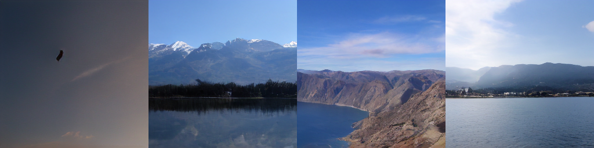
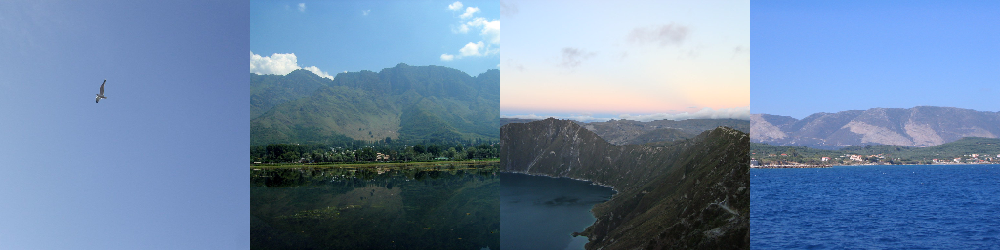

# 第二届计图人工智能挑战赛 - 风景图片生成赛道


## 简介

本仓库是[第二届计图人工智能挑战赛 - 风景图片生成赛道](https://www.educoder.net/competitions/index/Jittor-3)中我们队伍(jonelab)所采用的算法的代码实现。

我队基于论文 *High-Resolution Image Synthesis with Latent Diffusion Models*，使用[Jittor](https://cg.cs.tsinghua.edu.cn/jittor/) 框架，参考 [latent-diffusion](https://github.com/CompVis/latent-diffusion)，实现了Latent Diffusion模型，并在比赛数据集上进行训练和调参，最终取得第十名。

我主要实现了 train_*.py， inference.py 以及扩散模型部分。我队友主要负责UNet等具体模块的实现。我负责分工协调和汇总工作。

代码中还使用了类似 [wandb](https://wandb.ai/home) 之类的实验工具，下面是实验中验证集上的结果（由wandb记录）。






注：第一行是语意图，第二行是我的的模型的生成图，第三行是原数据集中对应的图。


## 安装 

#### 运行环境

- ubuntu 20.04 LTS
- python >= 3.7
- jittor >= 1.3.0

#### 安装依赖

执行以下命令安装 python 依赖
```
pip install -r requirements.txt
```

### 预训练模型

下载预训练模型 [download link](https://drive.google.com/file/d/1aiWyD1bC6u3ajwEoZol4Br_qNjCa-pJR/view?usp=sharing)，放到`ckpts/`下。

## 数据准备

```python
DATA_DIR/
|-- train_val/
|   |-- 1.jpg
|   |
|   |-- train.txt
|   |-- val.txt
|
|-- test/
|   |-- 1.jpg
|   |
|   |-- test.txt
|
|-- test_B/
|   |-- 1.jpg
|   |
|   |-- test_B.txt

```

在configs文件夹下的配置文件中修改数据集路径。


## 训练

模型分为两阶段：vqgan和ldm，分开训练

- 单卡训练可运行以下命令：
```
python train_vqgan.py

python train_ldm.py 
```

- 多卡训练可以运行以下命令：
```
mpirun --allow-run-as-root -np 2 python train_vqgan.py

mpirun --allow-run-as-root -np 2 python train_ldm.py 
```

## 推理

生成测试集上的结果可以运行以下命令：

```
python inference_jittor.py
```


另外可以参考我队友的开源版本[link](https://github.com/Js2Hou/jittor-jonelab-landscape_synthesis)。
